Fish and Chips and Apache Kafka\ :sup:`®`
=========================================

    By Tibs (they / he)

    Slides and source code at
    https://github.com/aiven-labs/fish-and-chips-and-kafka

    Tutorial at https://aiven.io/developer/fish-and-chips-and-kafka

    Me at https://aiven.io/community/devrel/tibs

    *or something*

-----

    I'm a Developer Educator at Aiven.

    Aiven: The trusted
    open source data
    platform for everyone.

    Since 2022, I've been working as a Developer Educator at Aiven.
    Before that I was a software developer for many years, and the last decade or
    so was working with cloud technologies, doing backend web stuff.

    As a Developer Educator, that means I get paid to
    understand (and then explain) various things that I'd never before had the
    time to get a proper understanding of, and that includes Apache Kafka®, which
    I want to tell you about today.

    As I work for Aiven, and Aiven's aim
    is to make developers lives easier, by providing

    The trusted
    open source data
    platform for everyone.

    the demos I'll show use the Aiven platform, but that's not required - it's
    just super convenient for me. And the demos are recorded, because I don't want
    to risk wifi at a conference.

What we'll cover
----------------

* Me and messaging and Apache Kafka\ :sup:`®`
* Fish and chips

  * How to talk to Kafka
  * Start with a simple model and work up
  * There's a demo you can play with afterwards
  * Some ideas for things you can do to extend the demos

----

Some message problems I've cared about
--------------------------------------

* between components on a Set Top Box

* configuration between microservices

* to / from Internet of Things devices, and their support systems

Kafka is a very good fit for the IoT cases, maybe less so for the others

----

I've been working, on and off, with sending messages between systems
throughout my career as a software developer, including messages between
processes on a set top box, messages to/from IoT (Internet of Things)
devices and their support systems, and configuration messages between
microservices.

For many of those purposes, I would now expect to use Apache Kafka, and this
talk aims to show why it is a useful addition to the messaging toolkit.

Respectively, maybe want:

* zeromq or similar - lightweight, fast (or, of course kbus <smile>)
* a state machine and/or a persistent key/value store
* Apache Kafka

What I want from messaging
--------------------------

* multiple producers *and* multiple consumers
* single delivery
* guaranteed delivery
* resumes safely if system crashes
* no back pressure handling (queue does not fill up)

----

Why not to build it around a database?

Just don't, really.

Mainly it means you have to *implement* all of a queuing system, over
something that is designed for different purposes / constraints.

Enter, Apache Kafka\ :sup:`®`
-----------------------------

.. Actually give the high-level explanation of what Kafka *is*

----

From Olena Kutsenko's blog post `Apache Kafka® simply explained`_:

  Apache Kafka is an **event streaming platform** that is distributed, scalable,
  high-throughput, low-latency, and has a very large ecosystem.

  Or, simply put, it is **a platform to handle transportation of messages** across
  your multiple systems, multiple microservices, or any other working modules.
  This can be just frontend/backend applications, a set of IoT devices, or
  some other modules.

  Apache Kafka platform is **distributed**, meaning that it relies on multiple
  servers, with data replicated over multiple locations, making sure that if
  some servers fail, we're still fine.

  It is **scalable** and you can have as many servers as you need. You can start
  small and add more servers as your system grows. These servers can handle
  trillions of messages per day, ending up in petabytes of data persistently
  stored over disks.

  And what is great about Apache Kafka is its **community** and **a wide ecosystem**
  surrounding the technology. This includes the client libraries available for
  different programming languages and a set of data connectors to integrate
  Kafka with your existing external systems. Thus, you don't need to reinvent
  the wheel to start using Apache Kafka, instead you can rely on the work of
  amazing developers who solved similar issues already.

.. _`Apache Kafka® simply explained`: https://aiven.io/blog/kafka-simply-explained

Kafka terms
-----------

Messages are *Events*

*Producers* send messages, *Consumers* read them.

Can have multiple Producers and Consumers

A Producer send a message to a named *Topic*,
each Consumer reads from a single Topic

*Partitions* can be used to "spread the load" within a Topic

----

Producers, topics, consumers
----------------------------

.. raw:: pdf

   Spacer 0 30

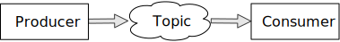

----

Events
------

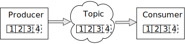

----

Multiple producers, multiple consumers
--------------------------------------

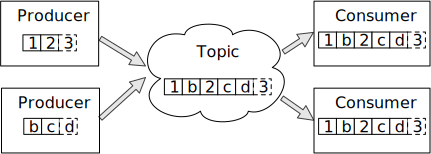

----

The consumers are independent, of each other

That is, each consumer remembers where it last read from (in the topic)
independently of the other.

Multiple partitions, consumer groups
------------------------------------

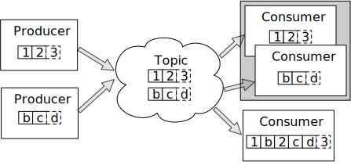

----

But what if you want consumers to *share* reading from a topic?

Then we have consumer groups.

Need consumers to be in different groups if I want them to read the same
messages (as I do for FOOD-PREPARER and ANALYST, for instance)

https://stackoverflow.com/questions/35561110/can-multiple-kafka-consumers-read-same-message-from-the-partition

https://www.oreilly.com/library/view/kafka-the-definitive/9781491936153/ch04.html -
consumers

Consumers can consume from multiple partitions, but only one consumer (in the
same consumer group) can read from each partition. So if there are N
partitions (in a consumer group) and N+X consumers, each wanting to read from
one partition each, X consumers will be idle.

"So the rule in Kafka is only one consumer in a consumer group can be assigned
to consume messages from a partition in a topic and hence multiple Kafka
consumers from a consumer group can not read the same message from a
partition."

Or, from "Effective Kafka" (Emil Koutanov) page 38,

  ...Kafka ensures that a partition may only be assigned to **at most one**
  consumer within its consumer group. (It is said "at most" to cover the case
  where all consumers are offline.)

https://gist.github.com/andrewlouis93/5fd10d8041aeaf733d3acfbd61f6bbef How are
partitions assigned in a consumer group? (GIST)

https://codingharbour.com/apache-kafka/what-is-a-consumer-group-in-kafka/ --
this looks like a nice article with good explanations

----

Finally, remember that:

* a producer publishes (sends) messages to one or more topics

* a consumer consumes (retrieves) messages from one or more topics

Let's model a fish-and-chip shop
--------------------------------

We start with a shop that

* just handles cod and chips
* which are always ready to be served

----

Glossary
--------

.. I'm sure everyone loves a glossary

* **Cod**: the traditional white fish for english fish-and-chip shops
* **Chips**: fatter, possibly soggier, french fries
* **Plaice**: a flat fish
* **Till**: a cash register

----

The thing that the chips are in ... basket? Fryer?

Also, Food Preparer is clumsy, but the alternative "Server" would get very
confusing in the context of cloud services...

Serving a customer
------------------

   .. raw:: pdf

      Spacer 0 30

..
   .. TILL -> [ORDER] -> FOOD-PREPARER

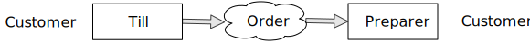

----

The CUSTOMER is implicit, and we'll not show them in future diagrams, nor do
we model them directly.

An order
--------

.. code:: json

   {
      "order": 271,
      "parts": [
          ["cod", "chips"],
          ["chips", "chips"],
      ]
   }

----

Show demo: 1 till, 1 food preparer
----------------------------------

.. raw:: pdf

   Spacer 0 30

1 till, 1 food preparer

<insert a picture of the TUI running>

----

Libraries
---------

To talk to Kafka and manage topics:

* ``aiokafka``: https://github.com/aio-libs/aiokafka
* ``kafka-python``: https://github.com/dpkp/kafka-python, for creating topics

To create our Terminal UI

* ``Textual``: https://github.com/Textualize/textual
* ``Rich``: https://github.com/Textualize/rich

----

Why asyncio?

Textual uses an event loop to drive its UI

Talking to Kafka is naturally async

----

Code: Create an SSL context
---------------------------

.. code:: python

    import aiokafka.helpers

    context = aiokafka.helpers.create_ssl_context(
        cafile=CERTS_DIR / "ca.pem",
        certfile=CERTS_DIR / "service.cert",
        keyfile=CERTS_DIR / "service.key",
    )

----

Code: Asynchronous Producer
---------------------------

.. code:: python

    from aiokafka import AIOKafkaProducer

    producer = aiokafka.AIOKafkaProducer(
        bootstrap_servers=f"{HOST}:{SSL_PORT}",
        security_protocol="SSL",
        ssl_context=context,
        value_serializer=lambda v: json.dumps(v).encode('ascii'),
    )

    await producer.start()

    while SHOP_IS_OPEN:
        await producer.send('ORDERS', message)

----

Code: Asynchronous Consumer
---------------------------

.. code:: python

    consumer = aiokafka.AIOKafkaConsumer(
        'ORDERS',
        bootstrap_servers=f"{HOST}:{SSL_PORT}",
        security_protocol="SSL",
        ssl_context=context,
        value_deserializer = lambda v: json.loads(v.decode('ascii')),
    )

    await consumer.start()

    async for message in consumer:
        print(f'Received {message.value}')

----

More customers - add more TILLs
-------------------------------

Customers now queue at multiple TILLs, each TILL is a Producer.

----

Three tills
-----------

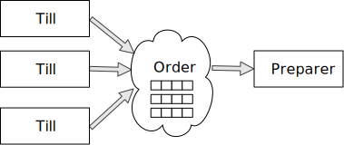

----

An order with multiple TILLs
----------------------------

.. code:: json

   {
      "order": 271,
      "till": 3,
      "parts": [
          ["cod", "chips"],
          ["chips", "chips"],
      ]
   }

----

We're just adding the ``till`` value to the same JSON we had before.

How we alter the code
---------------------

When creating the topic for the demo, request 3 partitions:

  .. code:: python

        NewTopic(
            name='DEMO2-ORDERS',
            num_partitions=3,
            replication_factor=1,
        )

.. raw:: pdf

   Spacer 0 10

Create 3 Till producers instead of 1

----

Show demo: 3 TILLs, 3 partitions
--------------------------------

.. raw:: pdf

   Spacer 0 30

Three tills, 3 partitions, 1 food preparer

.. but now the food producer is too busy

<insert a picture of the TUI running>

----

Add multiple *consumers*
------------------------

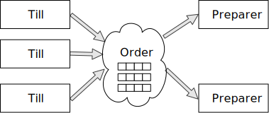

..
   ::

     TILL                             > FOOD-PREPARER
         \                           /
     TILL -> [ORDER with partitions]
         /                           \
     TILL                             > FOOD-PERPARER

----

Note that the number of consumers (food preparers) needs to less than, or
equal to, the number of tills (or, more precisely, to the number of partitions).

How we alter the code
---------------------

Create 2 Food preparer consumers instead of 1

Consumers need to be in same *consumer group*

.. code:: python

    consumer = aiokafka.AIOKafkaConsumer(
       ...
       group_id=CONSUMER_GROUP,
       ...

----

Start consuming from a specific offset
--------------------------------------

*If I run a demo more than once, there's a chance that a consumer might
receive events from the previous demo. So we want to make sure that doesn't
happen.*

Various solutions - simplest for this case is to do:

.. code:: python

    await consumer.seek_to_end()

----

Sending to different partitions
-------------------------------

.. code:: python

    await producer.send(TOPIC_NAME, value=order)

.. code:: python

    await producer.send(TOPIC_NAME, value=order, key='till')

.. code:: python

    await producer.send(TOPIC_NAME, value=order, partition=till_number-1)

----

Show demo: 3 TILLs, 2 PREPARERS
-------------------------------

.. raw:: pdf

   Spacer 0 30

3 tills, 3 partitions, 2 food preparers

<insert a picture of the TUI running>

----

Web console
-----------

.. When the image fits the (default) page, it's rather too small to be useful

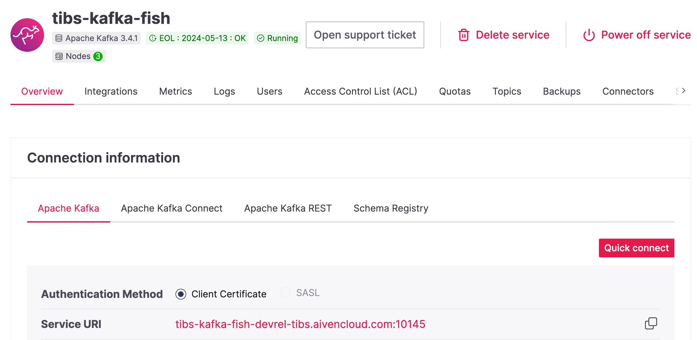

----

Topics in the web console
-------------------------

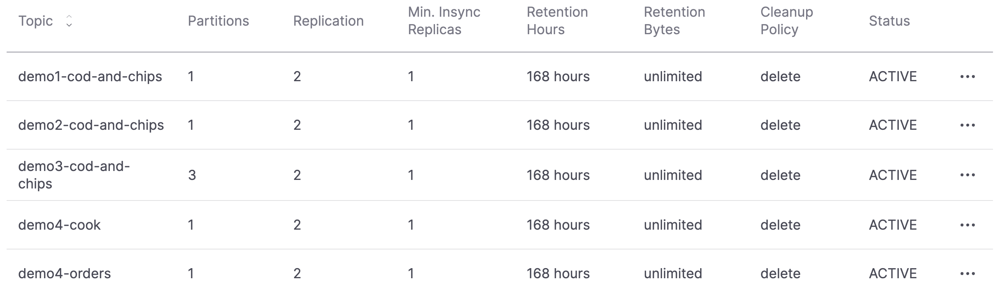

----

Demo 3 partition barchart
-------------------------

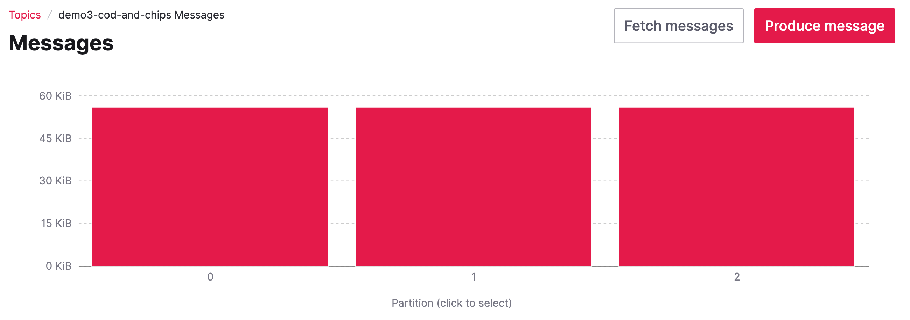

----

Demo 3 consumer groups
----------------------

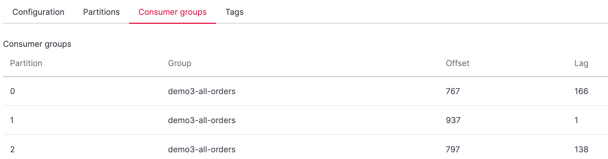

----

Demo 3 metrics
--------------

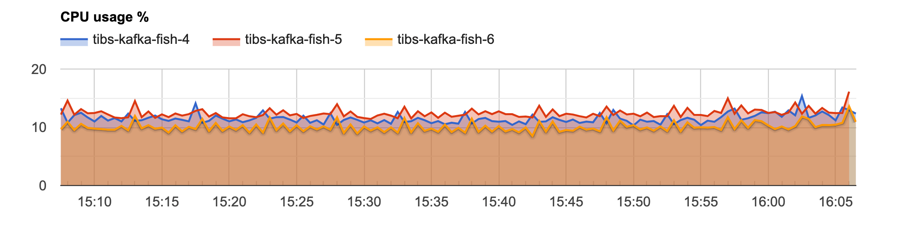

Showing CPU usage, but there's also disk space usage, disk iops (read and write), 5
minute load average, memory usage, and network receive/transmit

----

Cod or plaice
-------------

Plaice needs to be cooked

So we need a COOK to cook it

.. Keep it to the simple cod-and-chips order from demo 1, with COOK added, so it
   isn't too complicated to explain

----

Participant changes - add COOK
------------------------------

.. raw:: pdf

   Spacer 0 10

..
   ::

     TILL -> [ORDER] -> FOOD-PREPARER
                ^         |
                |      [COOK]
                |         |
                |         V
                +------- COOK

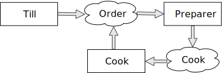

----

An order with plaice
--------------------

.. code:: json

   {
      "order": 271,
      "till": 3,
      "parts": [
          ["cod", "chips"],
          ["chips", "chips"],
          ["plaice", "chips"],
      ]
   }

----

This is the same sort of JSON as before, but now we're allowing ``plaice`` in
the parts of the order.

Gets turned into...
-------------------

.. code:: json

   {
      "order": 271,
      "till": 3,
      "parts": [
          ["cod", "chips"],
          ["chips", "chips"],
          ["plaice", "chips"],
      ],
      "ready": <boolean>
   }

----

Again, the same JSON, but now we're adding a ``ready`` boolean to indicate "is
this ready to be served to the customer" - that is, are all the items in the
order ready in the hot cabinet.

Code changes to the PREPARER
----------------------------

.. code:: python

    def all_order_available(self, order):
        if 'ready' not in order:
            all_items = itertools.chain(*order['order'])
            order['ready'] = 'plaice' not in all_items
        return order['ready']

.. code:: python

        order_available = self.all_order_available(order)
        if not order_available:
            await self.producer.send(COOK_TOPIC, order)

----

We don't change the TILL, so it still makes up JSON orders as before.

The PREPARER gets the ORDER and calls the ``all_order_available`` method,
to simulate looking in the hot cabinet.

What it actually does is to check if the ``ready`` flag is in the order.

If not, it adds it, and sets it to False if the customer asked for plaice, and
True if they did not. So the order is not ready if the customer wanted plaice.

It then returns that ``ready`` value.

The main loop then calls the new method, and if the order if *not* ready,
sends it to the COOK.

In other words:

* If the order has a "ready" value, and it is set to True, then everything is
  available from the hot cabinet, the order can be made up and passed to the
  customer

* If the order does not have a "ready" value, and there is no "plaice" in
  the order, then the PREPARER sets "ready" to True (everything can be made
  up from the hot cabinet) and the order is done

* If the order does not have a "ready" value, and there is "plaice" in the
  order, then the PREPARER sets "ready" to False, and the order is sent to the
  [COOK] topic for the COOK.

In the new COOK
---------------

.. code:: python

   async for message in consumer:
      ...
      # "Cook" the (plaice in the) order
      await asyncio.sleep(random.uniform(COOK_FREQ_MIN, COOK_FREQ_MAX))
      # It's important to remember to mark the order as ready now!
      # (forgetting to do that means the order will keep going round the loop)
      order['ready'] = True
      await self.producer.send(ORDERS_TOPIC, order)

----

When the COOK gets an order, they wait a bit to simulate cooking the plaice,
then set the "ready" flag to True, and send the order back to the ORDERS
topic.

The PREPARER will see the order again, and because the "ready" flag is True,
will now serve it to the customer.

Show demo: with COOK
--------------------

.. raw:: pdf

   Spacer 0 30

1 till, 1 food preparer, 1 COOK (back to 1 partition)

<insert a picture of the TUI running>

----

Summary so far
--------------

We know how to model the ordering and serving of our cod and chips

We know how to scale with multiple Producers and Consumers

We made a simple model for orders with plaice

----

Homework 1: Model cooking the fish and chips
--------------------------------------------

Use a Redis cache to simulate contents of the hot cabinet

Redis has entries for the hot cabinet content, keyed by ``cod``, (portions of)
``chips`` and ``plaice``. We start with 0 for all of them.

----

Using the cache
---------------

PREPARER compares the order to the counts in the (hot cabinet) cache.

* If there's enough, decrement the cache appropriately, order's done

* If not, sends the order to the COOK

COOK updates the cache

* For ``plaice``, adds as many as are needed

* For ``cod`` and ``chips``, cook enough to stock the hot cabinet

* Then sends the order back to the [ORDER] topic

----

This last is why the slightly icky "setting a boolean flag" trick isn't so
bad, as it is sort of simulating what we are doing above. It would be worth
explaining this, at this point

..
   Optional: Start of day
   ----------------------

   .. raw:: pdf

      Spacer 0 10

   .. image:: images/homework-redis-1.svg
      :width: 70%

   Optional: Cod and chips
   -----------------------

   .. raw:: pdf

      Spacer 0 10

   .. image:: images/homework-redis-2.svg
      :width: 100%

   Optional: Plaice and chips
   --------------------------

   .. image:: images/homework-redis-3.svg
      :width: 90%

Homework 2: Adding an ANALYST
-----------------------------

   .. raw:: pdf

      Spacer 0 10

..
   ::

     TILL -> [ORDER] -> FOOD-PREPARER
                     \
                      +-> ANALYST -> PG

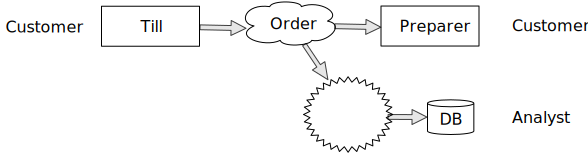

----

Using Kafka Connect
-------------------

   .. raw:: pdf

      Spacer 0 10

..
   ::

     TILL -> [ORDER] -> FOOD-PREPARER
                     \
                      +-> ANALYST -> PG

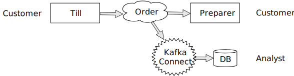

----

We could write our own interface to other services - that is, just add another
consumer that writes to PG - but Kafka Connect will scale with Kafka itself,
and doesn't involve having to write new Python code (and thus also doesn't
take resources from the Python client)

How I would do it
-----------------

The Aiven developer documentation
has instructions on how to do this at
https://docs.aiven.io/docs/products/kafka/kafka-connect/howto/jdbc-sink.html

* Create an appropriate PostgreSQL database and table
* Make sure that the Kafka service has Kafka Connect enabled
* Use the Aiven web console to setup a JDBC sink connector to send events to PG

And then add code to the Python demo to query PostgreSQL and make some sort of
report over time.

----

Final summary
-------------

We know how to model the ordering and serving of our cod and chips

We know how to scale with multiple Producers and Consumers

We made a simple model for orders with plaice

We talked briefly about how one might model the hot cabinet in more detail

We talked briefly about using Kafka Connectors to share data with other data users

Acknowledgements
----------------

Apache,
Apache Kafka,
Kafka,
and the Kafka logo
are either registered trademarks or trademarks of the Apache Software Foundation in the United States and/or other countries

Postgres and PostgreSQL are trademarks or registered trademarks of the
PostgreSQL Community Association of Canada, and used with their permission

.. I think I can omit the Redis ``*`` in the context of the slides

Redis is a registered trademark of Redis Ltd. Any rights therein are reserved to Redis Ltd.

.. -----------------------------------------------------------------------------

Fin
---

Get a free trial of Aiven services at
https://console.aiven.io/signup/email

Also, we're hiring! See https://aiven.io/careers

Written in reStructuredText_, converted to PDF using rst2pdf_

..
    |cc-attr-sharealike| This slideshow is released under a
    `Creative Commons Attribution-ShareAlike 4.0 International License`_

Slides and accompanying material |cc-attr-sharealike| at
https://github.com/aiven-labs/fish-and-chips-and-kafka

.. And that's the end of the slideshow

.. _`Creative Commons Attribution-ShareAlike 4.0 International License`: http://creativecommons.org/licenses/by-sa/4.0/

.. _reStructuredText: http://docutils.sourceforge.net/docs/ref/rst/restructuredtext.html
.. _rst2pdf: https://rst2pdf.org/
.. _Aiven: https://aiven.io/

Unused Redis slides
-------------------

Start of day
------------

.. raw:: pdf

   Spacer 0 10

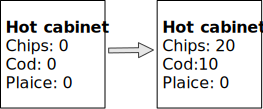

Cod and chips
-------------

.. raw:: pdf

   Spacer 0 10

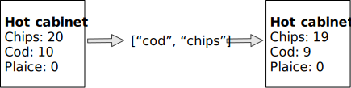

Plaice and chips
----------------

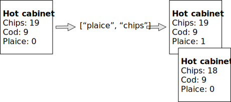
